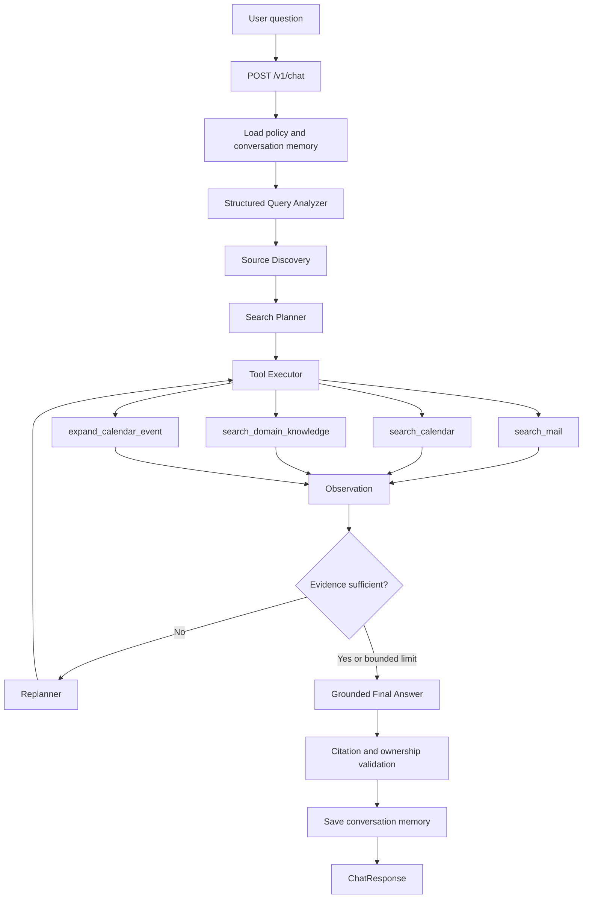

# Single Multi-Source Chat Entry Design

**Date:** 2026-08-17  
**Status:** Approved for written review  
**Scope:** Replace the `/v1/chat` route-selection layer with one direct
`MultiSourceAgenticWorkflow` entry point. Keep the separate research-job API and
the multi-source retrieval implementation intact.

## Problem

The multi-source agent is currently hidden behind the legacy Fast RAG route. Every
chat request first passes through a top-level router that can select `fast`, `deep`,
`general`, `clarify`, `diagnostic`, or `corpus_info`. Only `fast` delegates to the
multi-source graph.

This creates two competing intent systems:

1. the top-level router interprets arbitrary user language and selects an execution
   system;
2. the multi-source Query Analyzer interprets the same language and selects Mail,
   Calendar, or Domain Knowledge.

The first layer is unnecessary for the requested product. It can prevent Outlook
Calendar and other multi-source questions from reaching the agent, retains the
keyword-driven fallback that this work is intended to remove, and exposes obsolete
Fast/Deep route concepts in the API and frontend.

## Goal

Every `/v1/chat` request must enter `MultiSourceAgenticWorkflow` directly after
identity, policy, and conversation-memory loading. There is no Fast/Deep/Diagnostic
route selection. The structured Query Analyzer is the sole natural-language intent
boundary, and the typed policy decides which allowlisted source tools may run.

## Considered Approaches

### 1. Hard cutover to a single chat entry point — selected

Remove the chat router, route branches, `response_mode`, and routing diagnostics.
Inject the multi-source workflow directly into the service container and update the
frontend to show agent execution rather than legacy route information.

This is the simplest truthful architecture and exactly matches the requested
single-agent flow. It intentionally changes the API contract before release rather
than preserving fields that no longer have meaning.

### 2. Preserve a compatibility routing envelope

Always execute the multi-source agent but continue accepting `response_mode` and
return a synthetic `fast` route. This would reduce immediate client changes, but it
would falsely describe execution and retain obsolete concepts throughout the code.
It is rejected.

### 3. Add a second multi-source chat endpoint

Keep `/v1/chat` and add another endpoint that invokes the multi-source agent
directly. This avoids a breaking change but creates two chat contracts and leaves
the incorrect path available. It is rejected.

## Target Architecture

There is exactly one execution path. A question that does not require retrieval is
still analyzed by the same typed contract; it produces no source requests and the
graph finishes without inventing a source. Analysis failure remains fail-closed and
performs zero searches.

## Backend Changes

### Chat API

`POST /v1/chat` performs only these orchestration steps:

1. validate the request and build `PolicyContext`;
2. load owner-scoped conversation memory;
3. invoke `MultiSourceAgenticWorkflow` directly;
4. sanitize the result and validate citations and ownership;
5. save the turn and typed agent-memory update;
6. return the public response.

The route-specific branches for general chat, clarification, Deep Research,
diagnostics, and corpus information are removed from the chat handler. No-evidence
behavior is owned by the multi-source graph; the API does not switch to a separate
general-answer workflow.

### Dependency wiring

`ServiceContainer` exposes a focused `agentic` chat dependency. Production and demo
containers construct `MultiSourceAgenticWorkflow` and assign it directly instead of
wrapping it in `FastRAGWorkflow`. The top-level `RouterService` is removed from chat
wiring.

The legacy router and general-intent modules are removed once no production or test
consumer remains. Legacy Fast RAG code is removed from chat wiring; unrelated
low-level retrieval helpers may remain only if another active subsystem imports
them. Dead Fast RAG workflow code and tests are removed rather than kept as an
alternative chat path.

### Research API

`/v1/research/{job_id}/status`, `/cancel`, `/retry`, and `/events` remain unchanged.
They are explicit job-management endpoints, not natural-language route choices.
Reusable Deep Research domain or coordinator code required by those endpoints also
remains. `/v1/chat` never selects Deep Research.

### Public contracts

`ChatRequest` removes `response_mode`. Requests containing that field are rejected
by the existing `extra="forbid"` policy, making stale clients visible instead of
silently ignoring their intent.

`ChatResponse` removes the legacy `mode` and `routing` fields. Execution behavior is
reported through `execution`, `quality`, `disclosures`, `references`, and the
bounded agent trace already produced by the multi-source workflow. If the public
response does not currently expose the safe agent trace, add a bounded optional
`agent_trace` field rather than recreating route diagnostics.

Conversation turn records stop storing synthetic `route`, `executed_system`, and
route reason values when they are used only by the removed chat diagnostics. Any
historical records remain readable with tolerant defaults; no data migration is
required for the in-development environment.

## Frontend Changes

Remove the Fast/Deep/Auto mode selector and always send `user_id`, `message`,
optional `conversation_id`, and filters. Remove route-step rendering and route-based
labels from the conversation and inspector panels.

The frontend continues to display:

- answer and citations;
- retrieval and quality status;
- disclosures and typed failures;
- actual search count and evidence count;
- safe multi-source agent trace and node-run diagnostics.

This preserves useful observability while removing the misleading notion that a
separate router selected an execution system.

## Security and Failure Behavior

The change does not broaden model authority. The LLM may select only typed logical
source requests. Deterministic code continues to inject owner and lifecycle
filters, map logical sources to configured aliases, resolve dates, cap actions,
block duplicate searches, authorize Calendar expansion, normalize evidence, and
validate citations.

If structured analysis is unavailable or invalid, the workflow returns the current
limited analysis-unavailable result and performs zero searches. Source failures
remain typed limited results. A failed execution is not replaced with ungrounded
general text.

## Testing

Implementation follows red-green TDD. Tests must prove:

1. `/v1/chat` invokes the multi-source workflow directly and never calls a router,
   Fast RAG workflow, Deep Research workflow, diagnostic helper, or corpus helper;
2. `response_mode` is rejected and the successful response contains no `mode` or
   `routing` fields;
3. Mail-only, Calendar-only, Domain-only, multi-source, no-source, follow-up, and
   analysis-unavailable requests all use the same entry point;
4. no-evidence and source-error cases stay limited and do not fall back to a
   separate general responder;
5. owner filtering, citation validation, conversation memory, and Calendar event
   expansion retain their existing guarantees;
6. production and demo containers expose the direct agentic dependency;
7. the CLI demo and frontend send no `response_mode`;
8. the frontend renders agent execution without route-based controls or labels;
9. legacy router tests and route-only chat tests are removed, while retained
   behavior is covered at the single-entry API boundary;
10. backend tests, frontend tests, lint/build, offline demo smoke, configured-model
    intent evaluation, and live API smoke pass.

## Non-Goals

- changing index mappings, aliases, embeddings, or ranking;
- changing the typed intent contract or reintroducing keyword interpretation;
- merging the explicit research-job API into chat;
- changing August business-day fixture contents;
- migrating historical conversation records in production;
- allowing arbitrary tools, indices, owner filters, or OpenSearch DSL from model
  output.

## Completion Criteria

The change is complete when a repository search finds no active `/v1/chat` path,
frontend control, demo request, or test fixture that selects Fast, Deep, General,
Diagnostic, Clarify, or Corpus Info; every chat request reaches the multi-source
graph directly; and the full verification matrix passes.
