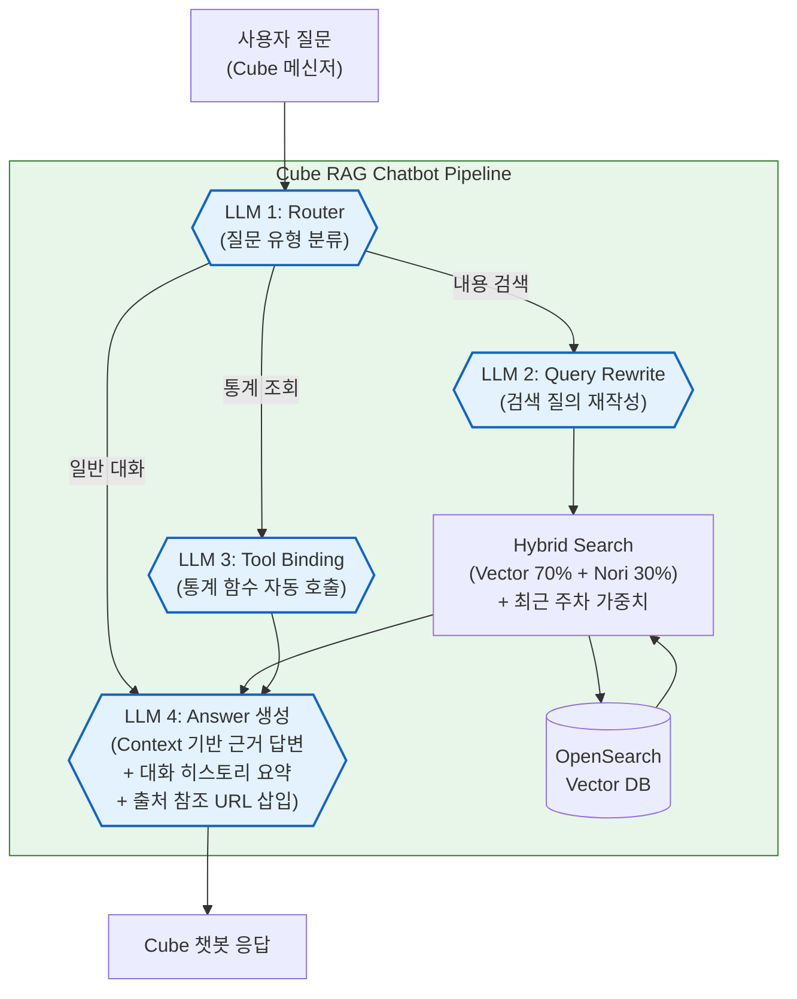
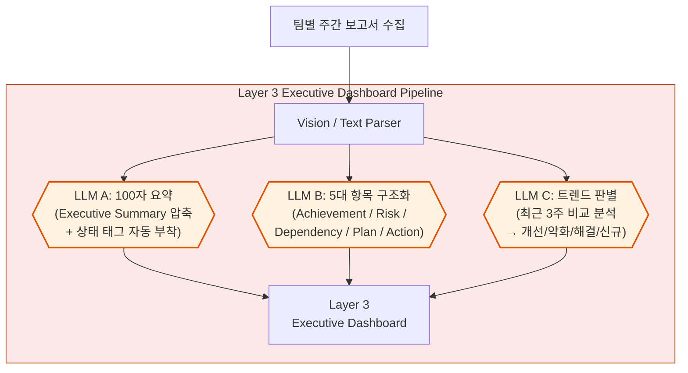

# Weekly Tech × Team AI Intelligence Architecture

---

## [슬라이드 1] 타이틀 (표지)
- **제목**: Weekly Tech × Team AI Intelligence Architecture
- **부제**: Cube 메신저 봇에서 Executive Dashboard(Layer 3)까지 이어지는 통합 생태계
- **발표자**: [이름/팀명]

---

## [슬라이드 2] 추진 배경 및 Problem Statement
- **현재의 한계점**: 
  - 각 부서와 팀 단위로 파편화된 주간보고서는 검색이 어렵고 히스토리 추적 불가능
  - 리더십이 줄글 보고 문서를 분석하는 데 압도적인 시간 리소스 발생
- **도입 목표**:
  1. **사내 메신저(Cube)** 내 대화형 자료 탐색 환경(RAG AI) 구성
  2. 경영진을 위한 **Layer 3 초압축 요약** 체계 제공

---

## [슬라이드 3] Cube RAG Chatbot – LLM이 관여하는 전체 흐름

---

## [슬라이드 4] Layer 3 Report – LLM이 관여하는 전체 흐름

---

## [슬라이드 5] Cube RAG Chatbot 상세 기능
- **LLM Router**: 사용자 질문을 분석해 내용검색 / 통계조회 / 일반대화로 자동 라우팅
- **Query Rewrite**: 검색 정확도 향상을 위해 LLM이 사용자 질문을 검색에 최적화된 쿼리로 재작성
- **Hybrid Search + 최근 주차 가중치**: Vector(70%) + Nori 형태소(30%) 이중 검색, 최신 주차 데이터에 가중치 부여
- **Tool Binding**: 통계 질문 시 LLM이 적절한 함수를 자동 선택/호출 (미제출팀 조회, 제출현황 등)
- **대화 히스토리 요약**: 멀티턴 대화 시 이전 대화를 LLM이 요약하여 문맥 유지
- **출처 추적**: 답변에 사용된 원문 문서의 참조 URL 자동 삽입

---

## [슬라이드 6] Layer 3 Executive Dashboard 상세 기능
- **100자 서술형 요약**: 원문의 사실/수치만으로 압축, 상태 태그 자동 부착
- **5대 항목 JSON 구조화**: Achievement / Risk / Dependency / Plan / Action 분리 추출
- **트렌드 시계열 분석**: 최근 3주 비교로 개선/악화/해결/신규 자동 판별
- **도메인 그룹핑**: 사업부별 리스크 집중도를 한눈에 파악

---

## [슬라이드 7] 기대효과
- **실무자/리더**: Cube 메신저에서 문서 리서치 리소스 제로화
- **경영진**: Layer 3 Dashboard 단일 화면에서 핵심 리스크 10초 컷 파악
